# BARIQ — Product & Engineering Master Plan

> الإصدار: 1.1
> الحالة: Architecture Baseline  
> اللغة الأساسية للواجهة: العربية RTL  
> Figma mobile baseline: `390×844`  
> التطبيق: Car Care, Wherever You Are

## 1. الهدف

BARIQ منصة تشغيل لخدمات غسيل وتلميع السيارات في موقع العميل. قيمة المنتج ليست مجرد شاشة حجز؛ القيمة الحقيقية هي تنسيق **الموقع، السعة، الفني، الدفع، إثبات التنفيذ، والدعم** في flow موثوق يمكن تشغيله في الواقع.

هذا الملف هو المصدر الرئيسي لقرارات المنتج والمعمارية والتنفيذ. ترتيب الأولوية:

1. `docs/ENGINEERING-CONSTRAINTS.md`.
2. القرارات المعمارية المسجلة هنا وملفات ADR.
3. عقود API والـstate machines.
4. تصميم Figma.
5. تفاصيل التنفيذ.

## 2. القرارات التنفيذية

| القرار | الاختيار | السبب |
|---|---|---|
| أسطح المنتج | Customer Flutter + Technician Flutter + Ops Web | احتياجات وصلاحيات ودورات إصدار مختلفة |
| تنظيم الكود | Monorepo مع packages مشتركة | توحيد tokens والعقود والأدوات دون خلط الـfeatures |
| Mobile architecture | Clean Architecture + Feature-First | عزل الـbusiness rules وقابلية الاختبار |
| State management | BLoC/Cubit + Freezed | state machines صريحة وقابلة للاختبار |
| Functional errors | `fpdart.Either<Failure, T>` | مسار نجاح/فشل typed دون exceptions عبر الطبقات |
| Backend | Supabase managed backend | أقل عبء تشغيل لمطور Flutter واحد مع Auth وData API وStorage وRealtime |
| Database | Supabase PostgreSQL + PostGIS | معاملات قوية واستعلامات نطاقات ومواقع |
| Data access | Supabase Flutter SDK + SQL/RPC | وصول typed من الـData layer وعمليات حساسة داخل Postgres/Edge Functions |
| Jobs | Supabase Cron/Queues عند حاجة مثبتة | retries وwebhooks والمهام المؤجلة بدون خادم دائم |
| Realtime | Supabase Realtime | تحديثات حالة الطلب وموقع الفني وفق RLS وسياسة بث محددة |
| Files | Supabase Storage | before/after evidence بسياسات Storage وروابط موقعة |
| Push | Firebase Cloud Messaging عبر Edge Functions | FCM مزود إشعارات فقط وليس backend ثانيًا |
| Payment MVP | Cash + Paymob | مساران واضحان دون توسع بوابات |
| ETA | Google Routes API من Edge Functions | route ETA لا straight-line distance ولا كشف مفاتيح في التطبيق |
| Integration reliability | Postgres transactions + idempotency | منع التكرار وحفظ صحة transitions والمدفوعات |

## 3. حدود الـMVP

### داخل الـMVP

- تسجيل/دخول برقم الهاتف وOTP.
- Profile أساسي ووسائل تواصل.
- سيارات محفوظة وعناوين محفوظة.
- 3 خدمات أساسية حسب zone وvehicle class.
- إضافات محدودة configurable.
- اختيار slot وفق السعة الفعلية.
- readiness checklist للموقع: ماء/كهرباء/مساحة/تصريح.
- Cash وPaymob.
- dispatch شبه تلقائي مع manual override.
- وصول الفني وتتبع محدود من `EN_ROUTE` إلى `ARRIVED`.
- Arrival PIN.
- before/after photos وchecklists.
- تقييم، شكوى، incident، وmanual refund.
- ledger وتسوية مبسطة للفنيين.
- لوحة عمليات يومية.

### خارج الـMVP

- Instant/on-demand booking.
- اشتراكات شهرية.
- B2B fleet management.
- Dynamic pricing متقدم.
- Loyalty/referrals.
- Multi-country/multi-currency.
- AI damage detection.
- Microservices.

## 4. أسطح المنتج والشاشات

### 4.1 Customer App

| المجموعة | الشاشات | النتيجة |
|---|---|---|
| App Startup | Native splash، app app startup، maintenance، force update | دخول آمن للحالة الصحيحة |
| Onboarding | 3 شرائح قيمة المنتج، language، permissions context | فهم الخدمة قبل طلب الصلاحيات |
| Auth | Phone، OTP، resend timer، profile setup | هوية موثقة |
| Home | greeting، saved location، services، active booking، recent vehicles | نقطة بداية واضحة |
| Services | list، details، inclusions، duration، starting price | اختيار واعٍ |
| Vehicles | list، add/edit، make/model/year/color/plate/class، default | تسعير وتنفيذ صحيح |
| Addresses | list، map picker، address details، access notes، readiness | التحقق من serviceability |
| Booking | vehicle → service/add-ons → address/readiness → slot → payment → review | flow حجز واحد متدرج |
| Confirmation | booking code، summary، next steps | ثقة بعد الإرسال |
| Active Booking | timeline، technician card، ETA، tracking، support/cancel rules | متابعة بدون غموض |
| History | upcoming/past، booking details، invoice، rebook | إدارة الطلبات |
| Notifications | operational inbox + deep links | الرجوع للحدث الصحيح |
| Support | FAQ، contact، complaint/incident، attachments | حل المشاكل |
| Rating | stars، tags، comment، issue escalation | feedback قابل للتشغيل |
| Profile | personal data، vehicles، addresses، payment preferences، language، privacy، logout | إدارة الحساب |

### 4.2 Technician App

| المجموعة | الشاشات |
|---|---|
| Access | phone/OTP، pending approval، suspended state |
| Work status | shift، online/offline، zone |
| Offers | incoming offer، countdown، accept/reject، offer details |
| Job | route، customer-safe contact، readiness notes، arrival action |
| Arrival | PIN verification، before photos، checklist |
| Execution | service checklist، timer/status، incident report |
| Completion | after photos، customer confirmation، completion summary |
| Work records | job history، earnings، ledger، settlement |
| Profile/support | equipment، vehicle، documents status، help |

### 4.3 Ops Web Dashboard

| المجموعة | الشاشات |
|---|---|
| Live operations | daily board، live map، unassigned/late/at-risk jobs |
| Booking management | search، detail، timeline، cancel/reschedule، manual assign |
| Workforce | technicians، approval، zones، capabilities، shifts، status |
| Catalog | services، add-ons، vehicle classes، prices، duration، availability |
| Capacity | zones، slot capacity، blackout dates |
| Finance | payment attempts، webhook state، refunds، ledger، settlements |
| Support | complaints، incidents، evidence، audit trail |
| Communication | notification templates، resend |
| Reporting | bookings، completion، cancellation، utilization، SLA، rating |

## 5. End-to-End Customer Flow

```mermaid
flowchart LR
    A["Splash / App Startup"] --> B{"Authenticated?"}
    B -- "No" --> C["Onboarding"]
    C --> D["Phone + OTP"]
    D --> E["Profile setup"]
    B -- "Yes" --> F["Home"]
    E --> F
    F --> G["Select vehicle"]
    G --> H["Select service + add-ons"]
    H --> I["Select address + readiness"]
    I --> J["Fetch available slots"]
    J --> K["Select payment"]
    K --> L["Review booking"]
    L --> M{"Payment method"}
    M -- "Cash" --> N["Confirmed"]
    M -- "Paymob" --> O["Pending payment"]
    O --> P{"Verified webhook"}
    P -- "Success" --> N
    P -- "Failure/timeout" --> Q["Payment failed"]
    N --> R["Dispatch"]
    R --> S["Assigned"]
    S --> T["En route + tracking"]
    T --> U["Arrival PIN"]
    U --> V["Before evidence"]
    V --> W["In service"]
    W --> X["After evidence + quality"]
    X --> Y["Completed"]
    Y --> Z["Rating / Support"]
```

## 6. System Context

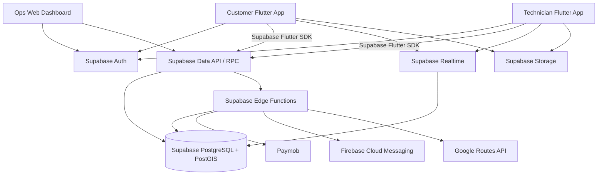

## 7. Deployment Topology

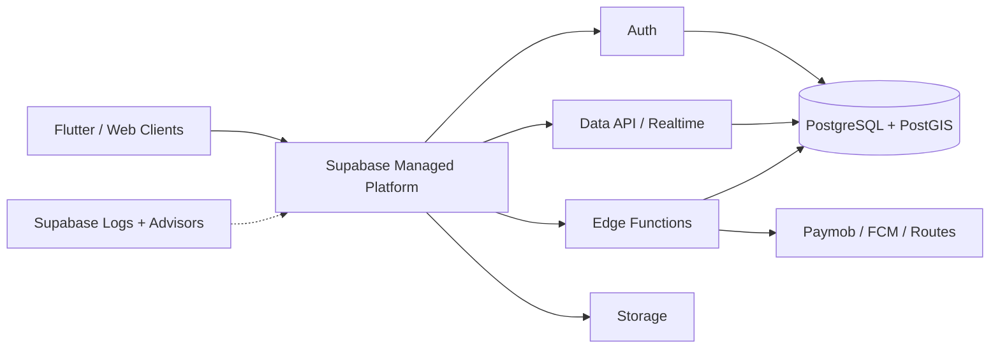

لا توجد API أوWorker servers يديرها مطور التطبيق في الـMVP. أي منطق يحتاج secret أوصلاحية مرتفعة يوضع في Edge Function أوعملية SQL/RPC محمية، ولا ينفذ داخل Flutter.

## 8. Supabase Backend Boundaries

### 8.1 Modules

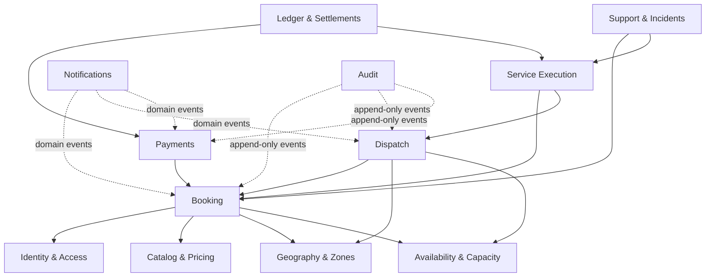

### 8.2 Backend Folder Pattern

```text
supabase/
├── config.toml
├── migrations/
├── functions/
│   ├── _shared/
│   ├── create-payment/
│   ├── paymob-webhook/
│   ├── dispatch-booking/
│   └── send-notification/
├── seed.sql
└── tests/
    └── database/
```

قواعد الحدود:

- كل جدول في schema مكشوف يفعّل عليه RLS وتكتب له policies حسب الملكية والدور.
- Flutter يستخدم publishable key فقط؛ `service_role` وأسرار الدفع لا تدخل التطبيق أوGit.
- عمليات status transitions والمدفوعات والتعيين تنفذ داخل SQL/RPC أوEdge Functions، وليس writes حرة من العميل.
- migrations هي المصدر الوحيد لتاريخ schema، وتراجع بـDatabase Advisors واختبارات RLS.
- لا نضيف Cron أوQueues أوFunctions قبل وجود flow يحتاجها فعليًا.

## 9. Mobile Architecture

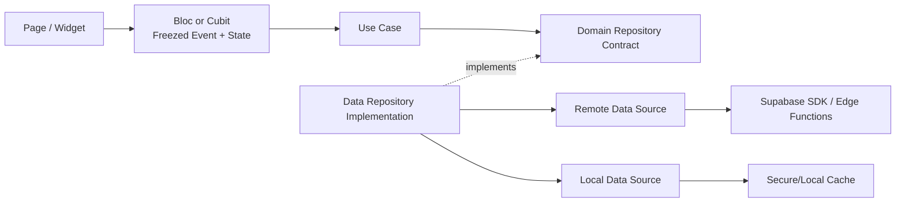

### 9.1 Monorepo Layout

```text
bariq/
├── apps/
│   ├── customer_app/
│   ├── technician_app/
│   └── ops_web/
├── packages/
│   ├── bariq_design_system/
│   ├── bariq_core/
│   ├── bariq_api_client/
│   └── bariq_lints/
├── supabase/
├── docs/
└── tooling/
```

لأن المشروع الحالي بدأ كتطبيق Flutter واحد، النقل إلى monorepo يتم في مرحلة مستقلة بعد تثبيت splash/app startup، وليس rewrite متزامنًا مع أول feature.

### 9.2 Customer Features

```text
features/
├── app_startup/
├── onboarding/
├── auth/
├── home/
├── profile/
├── vehicles/
├── addresses/
├── service_catalog/
├── booking/
├── payments/
├── active_booking/
├── booking_history/
├── notifications/
├── ratings/
└── support/
```

### 9.3 BLoC Selection

| الحالة | الأداة | مثال |
|---|---|---|
| state محلية بسيطة وأحداث قليلة | Cubit | language/theme toggle |
| flow متعدد الخطوات أو مصادر أحداث | Bloc | auth، booking، payment، tracking |
| server-authoritative lifecycle | Bloc | active booking |

مثال state صحيح:

```dart
@freezed
sealed class BookingState with _$BookingState {
  const factory BookingState.initial() = BookingInitial;
  const factory BookingState.loading() = BookingLoading;
  const factory BookingState.ready(BookingDraft draft) = BookingReady;
  const factory BookingState.submitting(BookingDraft draft) = BookingSubmitting;
  const factory BookingState.success(Booking booking) = BookingSuccess;
  const factory BookingState.failure(Failure failure) = BookingFailure;
}
```

## 10. API Contract Rules

- Base path: `/api/v1`.
- JSON uses ISO-8601 UTC timestamps؛ timezone conversion في client.
- IDs تكون UUID.
- كل mutation حساس يقبل `Idempotency-Key`.
- Pagination تكون cursor-based للقوائم المتغيرة.
- Error envelope موحد:

```json
{
  "code": "BOOKING_SLOT_UNAVAILABLE",
  "message": "The selected slot is no longer available.",
  "details": {},
  "traceId": "..."
}
```

- Client لا يفسر HTTP message الخام؛ يحول `code` إلى Failure ورسالة localized.
- OpenAPI هو العقد الموثق، والـAPI client يُولد أو يراجع ضده.
- Authorization server-side على كل resource، وليس إخفاء زر في UI.

## 11. Core Data Model

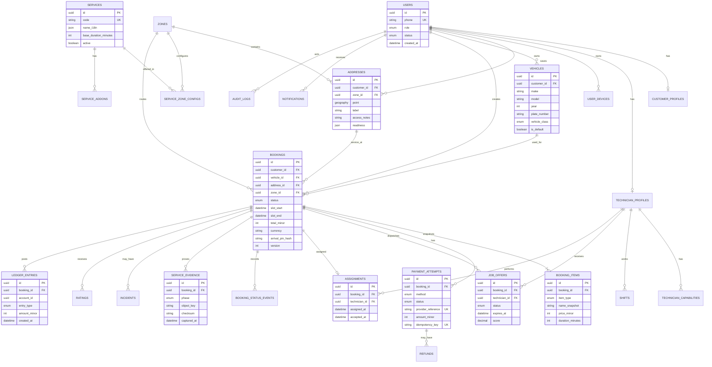

ملاحظات:

- الأسعار وأسماء العناصر داخل الحجز snapshots لا تتغير بعد تعديل catalog.
- لا يوجد `payment_id` وحيد داخل booking؛ توجد attempts متعددة.
- `version` يدعم optimistic concurrency.
- Arrival PIN يخزن hash وليس النص الخام.
- Evidence يخزن metadata/object key، وليس binary داخل PostgreSQL.

## 12. Booking State Machine

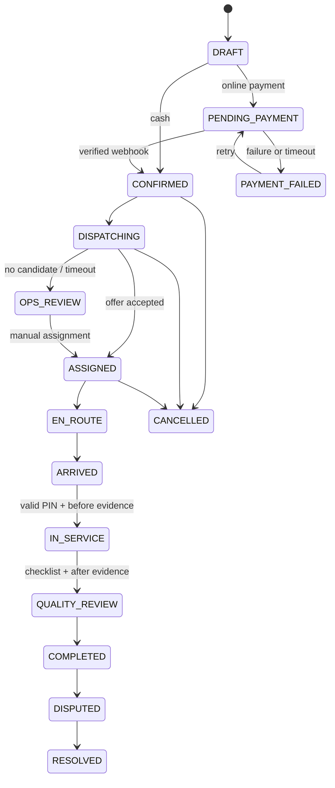

الـbackend هو المصدر الوحيد لصحة الانتقالات. التطبيق يرسل intent، ولا يكتب status مباشرة.

## 13. Booking Sequence

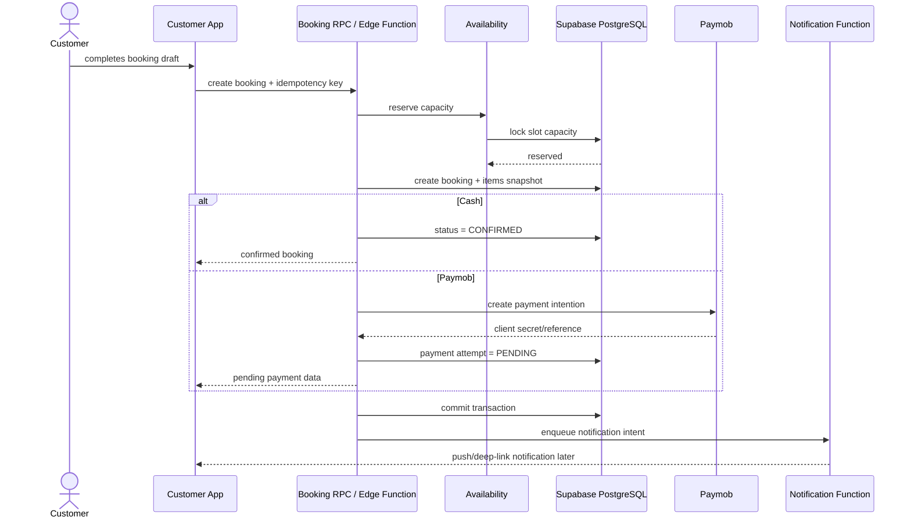

## 14. Payment Flow

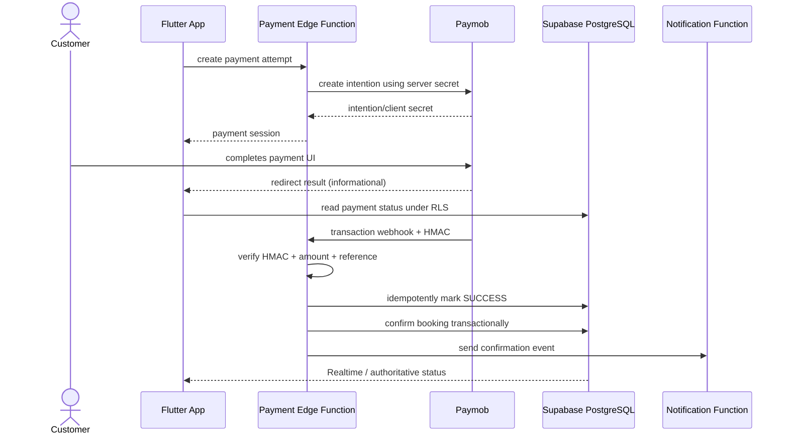

قواعد:

- Redirect لا يؤكد نجاح الدفع.
- webhook handler idempotent ويقاوم التكرار والخروج عن الترتيب.
- كل refund سجل مستقل وحالته مستقلة.
- لا card data ولاpayment token في BARIQ storage.

## 15. Dispatch Algorithm

### 15.1 Candidate Filters

1. Technician approved، online، وداخل shift.
2. يغطي zone والخدمة والمعدات المطلوبة.
3. لا يوجد time overlap مع assignment قائم.
4. يستطيع الوصول قبل نافذة الخدمة وفق route ETA.
5. ليس suspended أوعليه incident يمنع assignment.

### 15.2 Scoring

```text
score =
  route_eta_weight
  + idle_time_weight
  + on_time_rate_weight
  + acceptance_rate_weight
  + fairness_weight
```

الأوزان configurable ولا توضع داخل app.

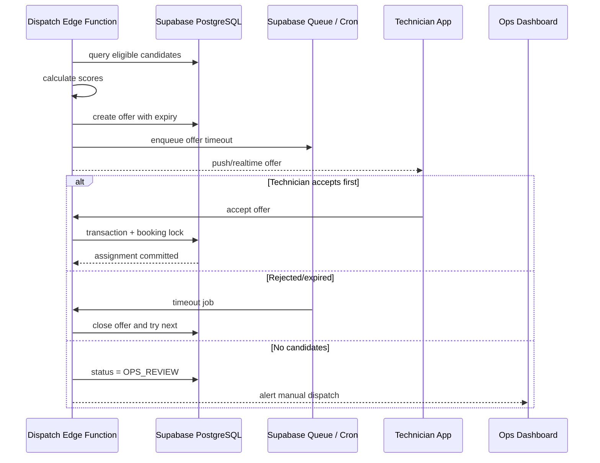

## 16. Live Tracking

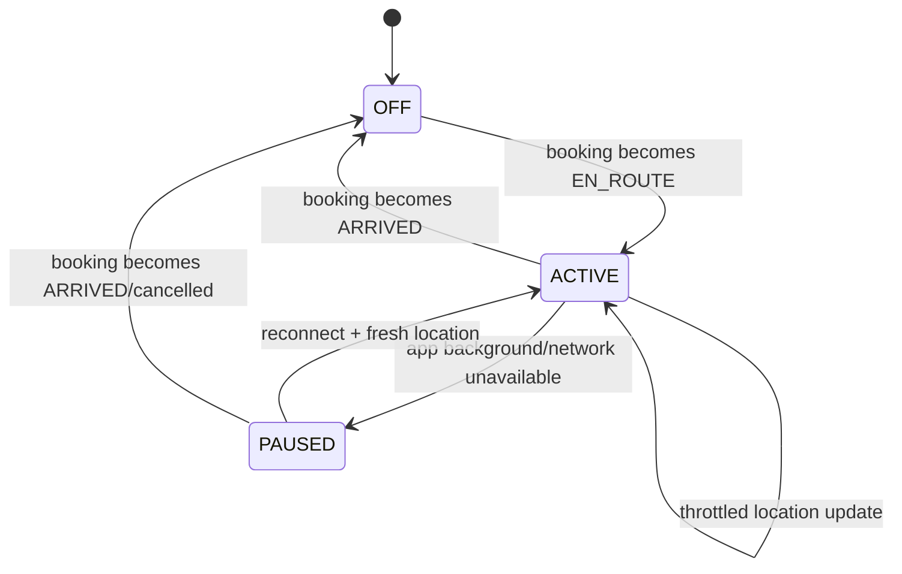

- الموقع يجمع فقط خلال `EN_ROUTE -> ARRIVED`.
- السيرفر يقبل location من technician assigned فقط.
- كل point له timestamp وTTL؛ النقاط القديمة لا تعرض كـlive.
- client يرسل بمعدل متوازن ويعمل backoff؛ لا polling سريع.
- العميل يرى approximate ETA/location وفق سياسة الخصوصية، لا سجل تحركات دائم.

## 17. Security and Privacy

| الخطر | التحكم |
|---|---|
| OTP abuse | rate limit، attempt limit، expiry، device/IP signals |
| Broken object authorization | resource ownership/role checks في service layer |
| Payment spoofing | HMAC verification، amount/reference check، idempotency |
| Duplicate booking/payment | Idempotency-Key + DB constraints |
| Evidence leakage | signed URLs قصيرة العمر وauthorization قبل الإصدار |
| Location misuse | lifecycle-limited collection + TTL + audit |
| Secret exposure | environment/secret manager، `.env` ignored |
| PII in logs | structured redaction، no OTP/token/location payloads |
| Admin misuse | RBAC، audit log، step-up auth للrefund/sensitive actions |
| Race conditions | transactions، row locks، optimistic version |

## 18. Failure Model

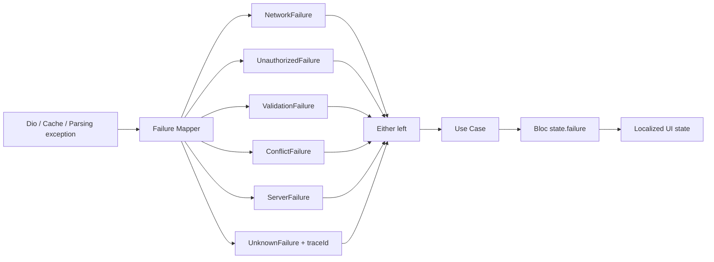

## 19. Offline and Retry Policy

- Catalog، vehicles، addresses، وhistory يمكن cache-read مع freshness metadata.
- slot availability، booking submission، payment status، dispatch، وPIN verification online-authoritative.
- mutation retry لا يحدث تلقائيًا إلا مع Idempotency-Key.
- offline UI تعرض آخر data بوضوح وتمنع actions التي قد تعطي وعدًا غير صحيح.
- reconnect يعيد fetch للحالة من السيرفر قبل استكمال flow حساس.

## 20. Testing Strategy

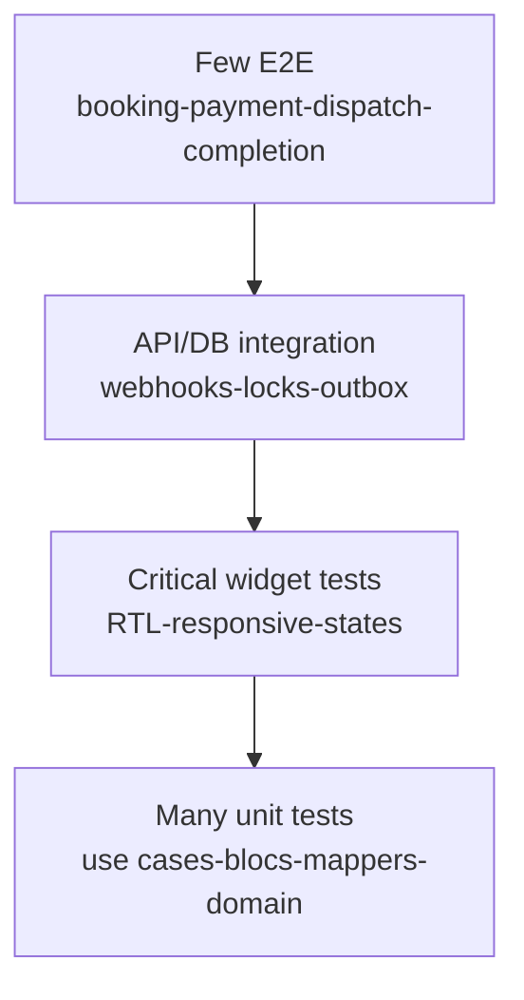

| المستوى | المطلوب |
|---|---|
| Domain unit | state rules، pricing snapshot، eligibility، Failure mapping |
| Use Case unit | success/failure لكل Use Case |
| Bloc/Cubit unit | كل event transition بما فيها retry/cancel |
| Repository | DTO↔Entity، status codes↔Failure، cache strategy |
| Widget | auth، booking steps، active timeline، error/empty/offline، RTL |
| Supabase integration | transaction locks، idempotency، PostGIS، RLS، Storage policies |
| Contract | migrations، RPC signatures، Edge Function payloads |
| E2E | happy path cash، Paymob webhook، dispatch timeout، complaint |
| Performance | slot search، dispatch query، active socket connections |

الأجهزة البصرية الإلزامية: small phone، `390×844` baseline، tablet.

## 21. Observability

- Structured logs داخل Edge Functions مع `traceId`, `userId` masked، `bookingId`.
- Metrics: function latency/error rate، queue depth/age، webhook failures، dispatch time، completion SLA، Realtime connections.
- تتبع flow عبر Edge Function → PostgreSQL → provider مع correlation IDs.
- Alerts: payment webhook failures، queue backlog، dispatch OPS_REVIEW spike، DB saturation، elevated OTP failures.
- Business dashboard: conversion، slot utilization، acceptance، on-time arrival، completion، cancellation، rating، repeat rate.

## 22. Git and Delivery Flow

```mermaid
gitGraph
    commit id: "main: production"
    branch develop
    checkout develop
    commit id: "integration baseline"
    branch feature/app-startup-foundation
    checkout feature/app-startup-foundation
    commit id: "feat: add design tokens"
    commit id: "test: cover app startup"
    checkout develop
    merge feature/app-startup-foundation id: "PR reviewed"
    branch feature/auth
    checkout feature/auth
    commit id: "feat: add otp flow"
    checkout develop
    merge feature/auth id: "PR reviewed"
    checkout main
    merge develop tag: "v0.1.0"
```

Conventional Commits:

- `feat(auth): add otp verification flow`
- `fix(booking): prevent duplicate slot submission`
- `test(payments): cover repeated webhook`
- `refactor(core): unify failure mapping`
- `docs(architecture): add dispatch ADR`

## 23. Delivery Roadmap

### Phase 0 — Foundation Remediation

Branch: `chore/foundation-hard-rules`

- نقل branding assets إلى `assets/branding`.
- إنشاء asset constants.
- إنشاء Design System كامل.
- تهيئة `ScreenUtilInit` على `390×844`.
- إضافة `fpdart`, `logger`, `flutter_dotenv`.
- تصحيح dependency placement حسب الاستخدام.
- إزالة raw colors/spacing/asset paths من الشاشات الحالية.
- app startup Cubit/Bloc بـFreezed.
- تحديث splash tests وwidget tests.
- تهيئة lints/codegen/scripts.

### Phase 1 — Identity & Profile

- onboarding، phone/OTP، session app startup.
- profile setup/edit.
- secure token storage.
- tests وAPI contracts.

### Phase 2 — Vehicles, Addresses, Catalog

- vehicle CRUD.
- address CRUD + map picker + zone serviceability + readiness.
- service catalog/details/pricing.

### Phase 3 — Booking & Capacity

- booking wizard.
- server slot capacity reservation.
- review/cash confirmation.
- idempotency and booking state machine.

### Phase 4 — Payment

- Paymob intention.
- verified webhook.
- retry/status reconciliation.
- payment attempts/refunds Ops views.

### Phase 5 — Technician & Dispatch

- technician access/shift/offers.
- dispatch worker/timeout/locking.
- Ops manual override.
- navigation and arrival PIN.

### Phase 6 — Execution & Tracking

- before/after evidence.
- checklists and quality review.
- limited live tracking.
- notifications.

### Phase 7 — Support, Ledger, Hardening

- rating، incidents، complaints.
- ledger/settlements.
- security/performance/accessibility/RTL pass.
- store readiness and production runbook.

## 24. Milestones and Exit Criteria

| milestone | exit criteria |
|---|---|
| M0 Foundation | constraints enforced، baseline tests green، splash stable |
| M1 Bookable | customer can create cash booking against real capacity |
| M2 Payable | Paymob flow reconciles only by verified webhook |
| M3 Dispatchable | technician offer/accept with race protection |
| M4 Executable | PIN + evidence + checklist reaches completion |
| M5 Operable | Ops can recover every stuck state manually with audit |
| M6 Pilot-ready | 2–3 zones، 10–15 technicians، monitoring/runbooks ready |

## 25. Definition of Ready

قبل بدء feature:

- [ ] user story وacceptance criteria واضحان.
- [ ] Figma states تشمل loading/empty/error/offline/success.
- [ ] API contract وauthorization معروفان.
- [ ] state machine أوevent list مكتوبة.
- [ ] analytics events محددة.
- [ ] test cases معروفة.
- [ ] dependencies وout-of-scope موثقان.

Definition of Done موجود في `docs/ENGINEERING-CONSTRAINTS.md` وهو إلزامي.

## 26. Architecture Decision Records

تنشأ داخل `docs/adr/`:

- `0001-modular-monolith.md`
- `0002-typeorm-postgis.md`
- `0003-bloc-freezed-fpdart.md`
- `0004-payment-webhook-source-of-truth.md`
- `0005-lifecycle-limited-location.md`
- `0006-transactional-outbox.md`
- `0007-mobile-monorepo.md`

كل ADR يحتوي: Context، Decision، Alternatives، Consequences، Status.

## 27. Open Product Decisions

هذه لا توقف foundation، لكنها يجب أن تحسم قبل features المعنية:

- المدن والـzones الأولى.
- الخدمات الثلاث وتفاصيل كل checklist.
- متطلبات الماء والكهرباء ومسؤولية العميل.
- cancellation windows والرسوم.
- technician employment/partner model والتسوية.
- retention period للصور والموقع والـaudit.
- refund authority levels.
- Arabic-only launch أم bilingual.

## 28. أهم Package Baseline لتطبيق Flutter

| الغرض | package |
|---|---|
| State | `flutter_bloc`, `bloc`, `freezed_annotation`, `freezed`, `build_runner` |
| Functional errors | `fpdart` |
| Backend SDK | `supabase_flutter` |
| External networking | `dio` فقط عندما لا يغطي Supabase التكامل |
| Routing | `go_router` |
| Dependency injection | `get_it`, `injectable`, `injectable_generator` |
| JSON | `json_annotation`, `json_serializable` |
| Responsive | `flutter_screenutil` |
| Config/secrets | `flutter_dotenv` |
| Logging | `logger` |
| Secure session | Supabase Auth persistence؛ لا نخزن access tokens يدويًا |
| Local cache | `shared_preferences` للخفيف؛ قاعدة محلية فقط عند حاجة مثبتة |
| Push only | `firebase_core`, `firebase_messaging` عند تنفيذ notifications |
| Location/maps | `geolocator`, `google_maps_flutter` |
| Media | `image_picker` مع upload abstraction |
| Localization | `easy_localization` أوحل موحد واحد فقط |
| Splash/icons | `flutter_native_splash`, `flutter_launcher_icons` |
| Testing | `bloc_test`, `mocktail` |

لا نضيف package لمجرد الاحتمال؛ كل dependency تُضاف مع أول feature يحتاجها.

## 29. References

- Supabase Flutter quickstart: <https://supabase.com/docs/guides/getting-started/quickstarts/flutter>
- Supabase phone login: <https://supabase.com/docs/guides/auth/phone-login>
- Supabase Row Level Security: <https://supabase.com/docs/guides/database/postgres/row-level-security>
- Supabase Edge Functions: <https://supabase.com/docs/guides/functions>
- Supabase securing the Data API: <https://supabase.com/docs/guides/api/securing-your-api>
- Paymob API integration paths: <https://developers.paymob.com/paymob-docs/integration-paths/apis>
- Paymob callbacks and HMAC: <https://developers.paymob.com/paymob-docs/developers/webhook-callbacks-and-hmac>
- Firebase Cloud Messaging for Flutter: <https://firebase.google.com/docs/cloud-messaging/flutter/receive-messages>
- Google Routes Compute Routes: <https://developers.google.com/maps/documentation/routes/compute-route-over>
