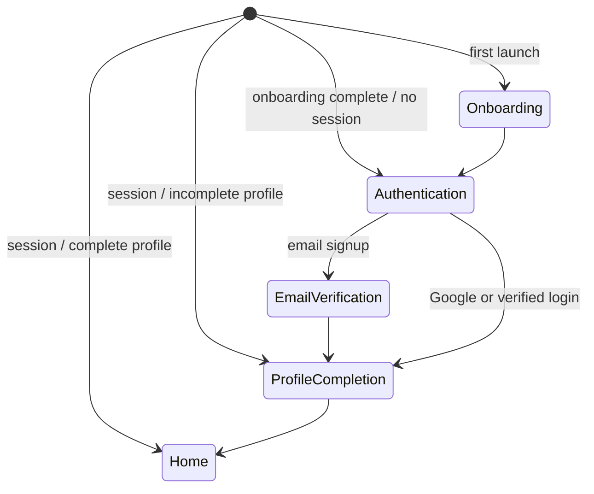

# ADR 0002 — Customer Authentication and Profile Flow

- Status: Accepted
- Date: 2026-08-04

## Context

BARIQ must keep the MVP operable without paid SMS delivery. Customer signup also
needs low friction and must avoid collecting sensitive documents that are not
required to provide an on-location car-care service.

## Decision

Customer authentication uses Supabase Auth with:

- Email and password signup/login.
- Email confirmation and password reset.
- Google OAuth through a single `Continue with Google` action on both auth pages.
- A first-login profile-completion gate before Home.

The minimum customer profile is:

- `full_name`: required.
- `phone`: required before the first booking; unverified while SMS is disabled.
- `city` and `area`: required before the first booking.
- `avatar_path` and `preferred_language`: optional.

Vehicles and addresses are separate resources and are requested contextually.
Before the first booking, the customer must have a phone number, one vehicle, and
one serviceable address.

Customer national ID, driving licence, and vehicle licence images are not
collected. If technician verification becomes necessary, it will be designed as
a separate privileged workflow with a private Storage bucket, strict RLS, short
signed URLs, audited access, and an explicit retention/deletion policy.

## Startup State

## Security Rules

- Flutter receives only a Supabase publishable key; never a secret/service-role key.
- Authorization roles never depend on user-editable `user_metadata`.
- The future `profiles` table uses `id = auth.uid()` and ownership-based RLS for
  select/update, including both `USING` and `WITH CHECK` on updates.
- Auth errors shown to users stay generic where a detailed message could expose
  whether an account exists.
- Passwords, tokens, and sensitive profile payloads are never logged.

## Consequences

- There is no SMS cost in the customer authentication flow.
- Google reduces signup friction; email/password remains a complete fallback.
- Phone ownership is not verified in the MVP, so the UI and business rules must
  not represent it as verified.
- The product stores less high-risk PII and avoids a document-verification flow
  that does not add value to customer car-wash bookings.
