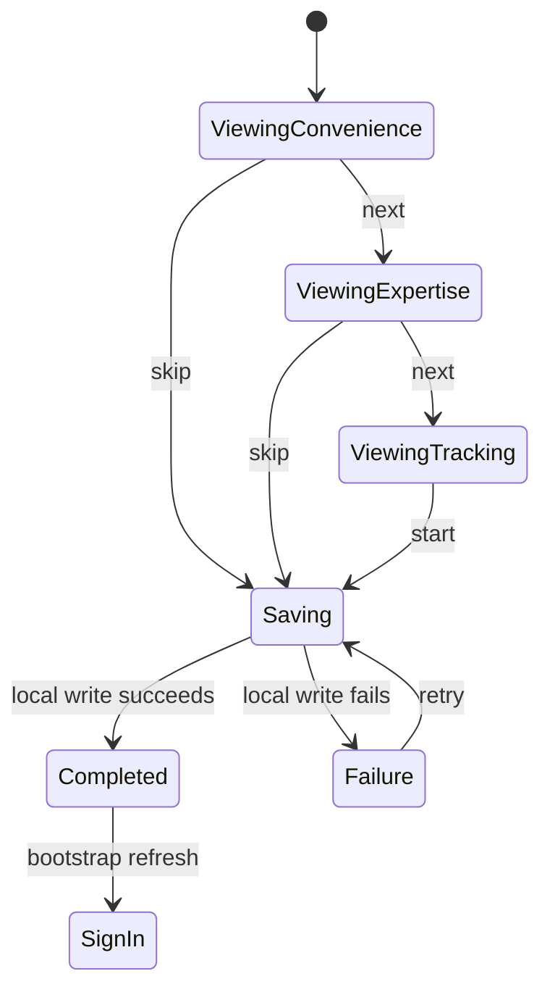

# BARIQ — Onboarding Feature

## Status

- Phase: `Phase 1 — Identity & Profile`
- Branch: `feature/onboarding`
- Design baseline: `390×844`
- UI engine: `introduction_screen ^4.0.0` with custom photo-led pages
- Visual direction: premium, photorealistic automotive campaign imagery
- Interface direction: Arabic RTL

## User Story

As a first-time customer, I want a short introduction to BARIQ's value and
trust model so that I understand the service before signing in.

## Acceptance Criteria

1. A customer who has not completed onboarding sees the Convenience screen.
2. Selecting "التالي" moves through Expertise, then Tracking.
3. Selecting "تخطي" or "ابدأ الآن" persists onboarding completion locally.
4. After successful persistence, bootstrap resolves the next destination as
   sign-in.
5. A storage failure keeps the customer in onboarding and exposes a localized
   retry action.
6. Reopening the app after success does not show onboarding again.
7. The flow is RTL, accessible, and responsive on a small phone, the `390×844`
   baseline, and tablet layouts.

## State Machine



## Architecture

```text
OnboardingPage -> OnboardingCubit -> CompleteOnboarding
    -> OnboardingRepository -> OnboardingLocalDataSource
    -> SharedPreferencesAsync
```

## Test Plan

- Use case: forwards success and failure from the repository.
- Repository: maps local storage exceptions to `CacheFailure` and unexpected
  exceptions to `UnexpectedFailure`.
- Cubit: page transition, successful completion, failed completion, retry.
- Widget: renders Convenience, moves through Expertise and Tracking,
  completes/skips, and renders failure.
- Regression: bootstrap tests continue to pass.

## Out of Scope

- Phone/OTP authentication.
- Runtime location permission; its contextual screen follows authentication.
- Language switching; the MVP interface remains Arabic RTL.
