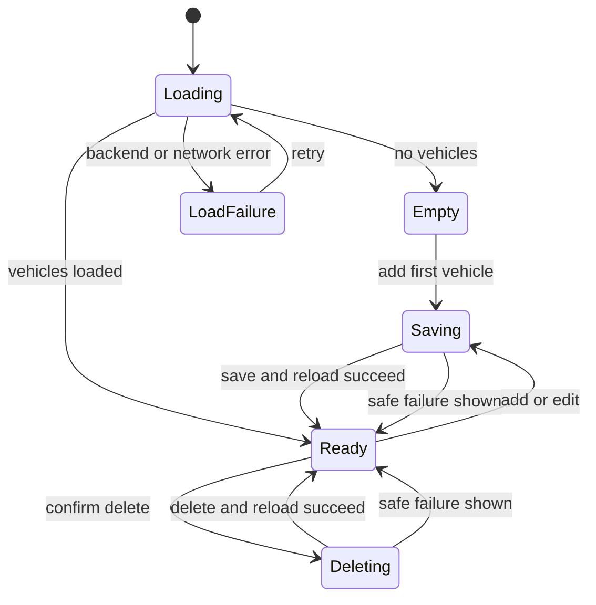

# BARIQ — Customer Vehicles

## User Story

As an authenticated customer with a completed profile, I want to manage my
vehicles so BARIQ can select the correct vehicle and service-size category when
I start a booking.

## Acceptance Criteria

- Home opens the customer's private vehicle catalog.
- An empty customer sees a clear first-vehicle action.
- A vehicle contains make, model, model year, color, plate number, and service
  class: sedan, SUV, hatchback, pickup, or van.
- Flutter validates and normalizes input before contacting the backend.
- PostgreSQL trims stored text and rejects invalid lengths, years, classes, and
  duplicate normalized plate numbers for the same customer.
- The first vehicle becomes default automatically.
- Setting another vehicle as default switches the default atomically.
- Deleting the default vehicle promotes the oldest remaining vehicle.
- Create, edit, and delete operations refresh the server-authoritative list.
- Loading, empty, saving, deleting, validation, offline, and retry states are
  explicit.
- Delete requires customer confirmation.
- The flow is RTL, scroll-safe, and tested on small phone and tablet sizes.
- No customer licence image or vehicle-document image is collected.

## Backend Contract

- Table: `public.vehicles`
- Owner: `vehicles.customer_id = auth.uid()`
- Client table access: authenticated `SELECT` only, protected by ownership RLS
- Mutation API: `save_my_vehicle(...)` and `delete_my_vehicle(uuid)` RPCs
- Mutation authorization: each RPC derives ownership from `auth.uid()`; a
  caller cannot provide or change `customer_id`
- Default invariant: a partial unique index allows at most one default vehicle
  per customer; RPC transactions preserve at least one default when rows exist
- Plate invariant: normalized plate numbers are unique per customer

## State Flow

## Out of Scope

- Vehicle licence upload or verification
- Vehicle photo and damage evidence
- Manufacturer/model master-data search
- VIN/chassis number
- Booking, pricing, and service availability
- Shared/fleet vehicles
